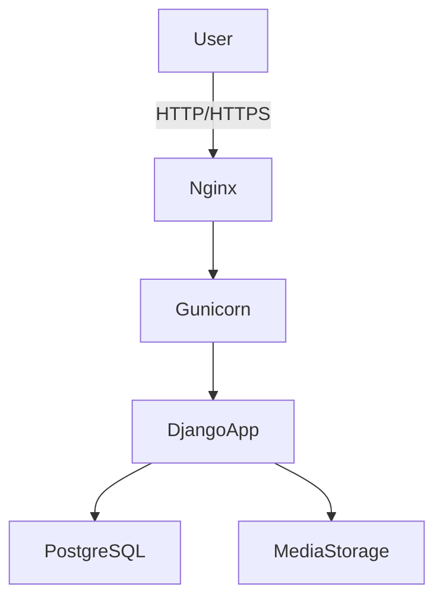

# Arsitektur Aplikasi Horilla

## Gambaran Umum
- Backend: Django (Python)
- Database: PostgreSQL
- API: Django REST Framework
- Deployment: Docker / Docker Compose
- Media: static & media folders

## Skalabilitas
- Modular apps (attendance, payroll, recruitment, dll)
- Load balancing dengan Gunicorn + Nginx
- DB clustering (PostgreSQL replication)
- Caching (Redis/Memcached)
- Task queue (Celery, opsional)

## Diagram
