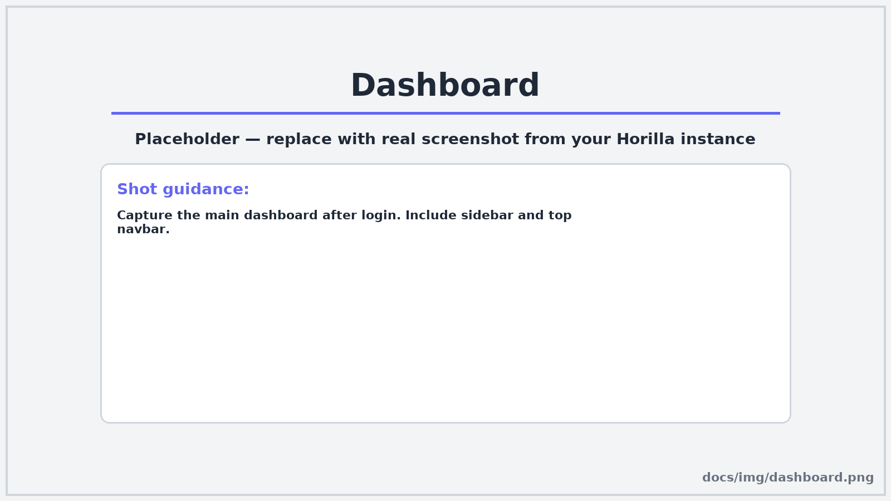
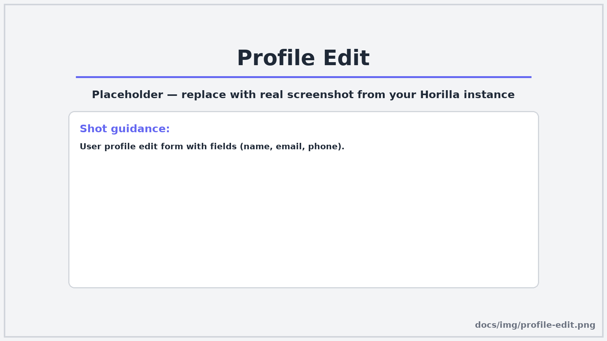
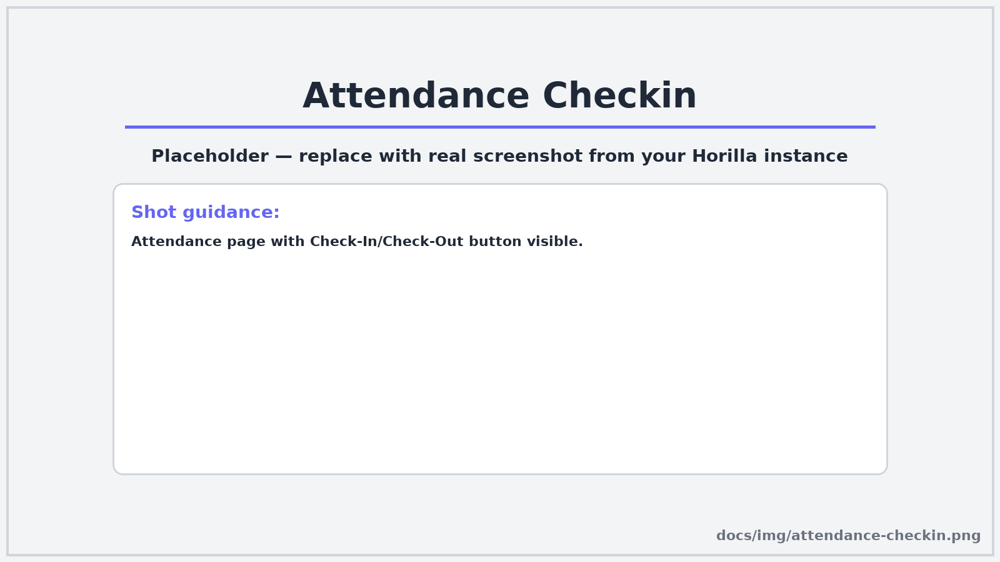
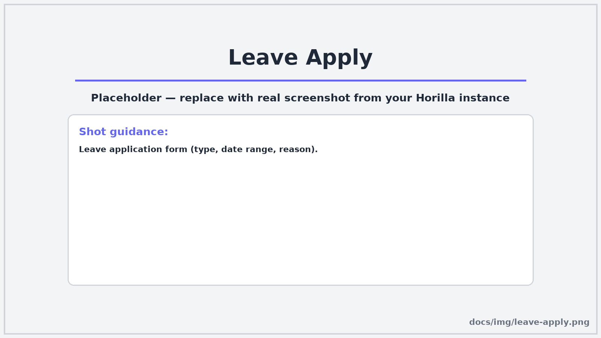

# :material-account-circle: Panduan Pengguna Horilla

> Untuk **karyawan (user biasa)** dan **atasan (manager)**. Dilengkapi ikon & placeholder screenshot—ganti file di folder `img/`.

---

## :material-rocket-launch: Mulai Cepat

1. Buka aplikasi: `https://app.domain`
2. Login dengan **username & password** atau **SSO/LDAP** (jika diaktifkan)
3. Tiba di **Dashboard**

{ loading=lazy }

!!! tip "Lupa password?"
    Klik **Forgot Password** pada halaman login. Jika pakai SSO, hubungi admin.

---

## :material-view-dashboard: Navigasi Utama

- :material-card-account-details-outline: **Profile**
- :material-calendar-check: **Attendance**
- :material-beach: **Leave**
- :material-cash: **Payroll**
- :material-lifebuoy: **Helpdesk**
- :material-check-decagram: **Approvals** *(untuk Manager)*
- :material-chart-box: **Reports** *(jika tersedia)*

---

## :material-card-account-details: Profil Karyawan

### Lihat & Ubah Profil
1. Masuk **Profile**
2. Edit field (alamat, kontak, foto) → **Save**

{ loading=lazy }

### Dokumen
- Unggah KTP/NPWP/KK sesuai kebijakan
- Perhatikan ukuran & tipe file

---

## :material-calendar-check: Kehadiran (Attendance)

### Check-In / Check-Out
1. Buka **Attendance**
2. Klik **Check-In** saat mulai kerja, **Check-Out** saat selesai

{ loading=lazy }

### Face Detection / Biometrik *(opsional)*
- Pastikan kamera menyala & izin browser aktif
- Pencahayaan cukup

### Geofencing *(opsional)*
- Aktifkan lokasi di perangkat
- Absen hanya di area yang diizinkan

!!! tip
    Pengajuan koreksi jam kehadiran lakukan via **Helpdesk** atau menu koreksi bila tersedia.

---

## :material-beach: Cuti (Leave)

### Ajukan Cuti
1. **Leave → Apply Leave**
2. Pilih jenis & tanggal, isi alasan → **Submit**

{ loading=lazy }

#### Alur Persetujuan
```mermaid
flowchart TD
  A[Employee Apply Leave] --> B[Validasi: kuota/rule]
  B -->|OK| C[Send to Approver]
  B -->|Tidak| X[Reject]
  C --> D{Approver Decide}
  D -->|Approve| E[HR Check (opsional)]
  D -->|Reject| X
  E --> F[Approved]
  F --> G[Notifikasi]
```