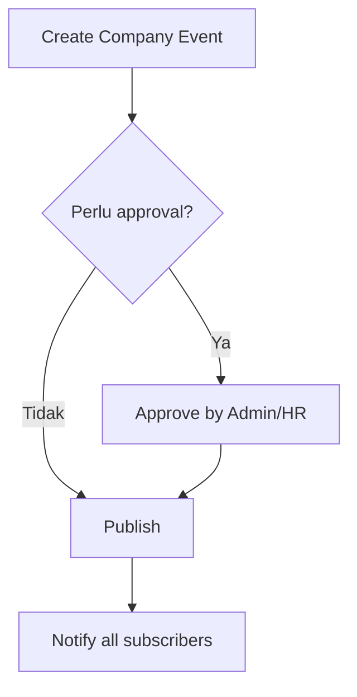

# :material-calendar-cog: Calendar (Admin)

Konfigurasi kalender perusahaan, kategori, pengingat default, serta libur nasional.

## Checklist Setup
- **Working days & timezone**
- **Holiday set** (libur nasional/kompensasi)
- **Event categories** (Meeting/Training/Company Event)
- **Default reminders** (mis. 30m sebelum)
- **Access control**: siapa yang bisa membuat company event

### Alur Publish Event Perusahaan

## RBAC (Contoh)
| Role     | Create (My) | Create (Company) | Update | Delete | Approve |
|----------|:-----------:|:----------------:|:------:|:------:|:-------:|
| Admin    | ✔︎          | ✔︎               | ✔︎     | ✔︎     | ✔︎      |
| HR/Owner | ✔︎          | ✔︎               | ✔︎     | ⚠︎     | ✔︎      |
| Manager  | ✔︎          | ✖︎               | ✔︎(tim)| ✖︎     | ✖︎      |
| Employee | ✔︎          | ✖︎               | ✖︎     | ✖︎     | ✖︎      |

## Data & Validasi
**Event**: title*, start_at*, end_at*, location, link, description, category, attendees[]  
Aturan: `end_at > start_at`, hindari overlap jika resource-based (opsional).

## Integrasi
- **ICS export** per calendar
- **Import ICS** (opsional)
- **Webhook** `event.created/updated/deleted` untuk sinkronisasi eksternal

## Operasional
- **Audit log**: pembuatan/perubahan/penghapusan event
- **Backup**: termasuk tabel event & holiday
- **Troubleshoot**: notifikasi tidak terkirim → cek SMTP/worker queue
