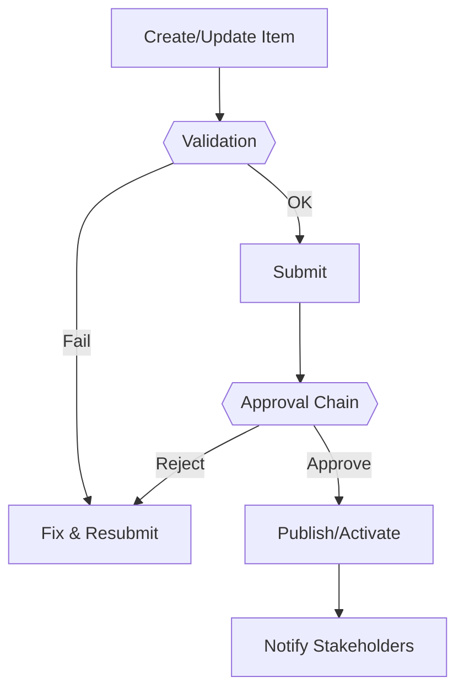

# Helpdesk — Panduan Administrator

> Dokumen ini untuk **administrator/HR admin/ops** yang mengelola modul **Helpdesk**: konfigurasi, peran/izin, integrasi, data, keamanan, pemeliharaan, dan troubleshooting.
> Terakhir diperbarui: 2025-09-17.

---

## 1) Ringkasan Modul & Tanggung Jawab Admin
- **Tujuan modul:** Tiket layanan HR/IT/Payroll.
- **Pemilik proses:** Service Desk / HR Ops
- **Dependensi:** Kategori, prioritas, SLA
- **Peran yang terlibat:** Admin, Agent, Employee (requester)
- **Data sensitif:** Lampiran tiket (potensi PII)

!!! note "Checklist kesiapan produksi"
    - Konfigurasi dasar selesai
    - Role & permission diuji minimal 1 siklus
    - Alur approval berjalan (happy path & edge case)
    - Backup/retention ditetapkan
    - Monitoring dasar aktif

---

## 2) Konfigurasi Dasar
1. Buka **Settings → Helpdesk**
2. Isi parameter utama:
   - - Kategori & prioritas
- SLA & eskalasi
- Template balasan
3. Simpan & lakukan smoke test (lihat bagian *Pengujian & Validasi*).

**Variabel lingkungan (opsional):**
- - SMTP untuk notifikasi

---

## 3) Role, Permission, dan Kebijakan Akses
- **Peran utama:** Admin, Agent, Employee (requester)
- **Akses minimum:** Employee create; Agent triage/resolve; Admin atur SLA
- **Kebijakan data:** Batasi akses ke tiket sensitif; redaksi bila perlu

Contoh pemetaan (sesuaikan di Django Admin/Role Manager):

| Role | Create | Read | Update | Delete | Approve |
|------|--------|------|--------|--------|---------|
| Admin | ✔ | ✔ | ✔ | ✔ | ✔ |
| HR/Owner | ✔ | ✔ | ✔ | ⚠ (terbatas) | ✔ |
| Manager | ✖ | ✔ (bawahan) | ✖ | ✖ | ✔ |
| Employee | ✖ | ✔ (pribadi) | ✖ | ✖ | ✖ |

---

## 4) Struktur Data & Validasi
**Entitas utama & field penting:**
- - Ticket (category, priority, status)
- Comment/Activity

**Validasi:** 
- Wajib: Kategori, deskripsi
- Unik: Ticket number
- Aturan khusus: Eskalasi otomatis jika melewati SLA

**Retensi & arsip:** Arsip tiket {24} bulan

---

## 5) Alur Kerja & Approval

**Konfigurasi approval:**
- Rantai approve: Tidak selalu; gunakan *approval step* untuk perubahan tertentu
- SLA internal: Respon awal < 4 jam, resolusi sesuai prioritas
- Notifikasi: email/in-app (pastikan SMTP aktif)

---

## 6) Integrasi & Otomatisasi (opsional)
- - Email-to-ticket (opsional)

**Webhook/Callback:** onTicketCreated, onTicketResolved
**Import/Export:** CSV/XLSX (periksa delimiter, encoding UTF-8)

---

## 7) Pengujian & Validasi
- **Smoke test:** buat → submit → approve → publish
- **Hak akses:** uji view/edit/delete per role
- **Data edge:** nilai kosong, tanggal bentrok, lampiran besar
- **Kinerja:** list >10k baris (gunakan filter & pagination)
- **Pembuktian:** screenshot/log hasil uji disimpan

---

## 8) Monitoring, Logging & Audit
- **Audit trail:** perubahan penting (create/update/delete/approve)
- **Log aplikasi:** error 4xx/5xx, timeout, validasi
- **Metrik:** throughput, error rate, waktu approve, backlog
- **Alert:** lonjakan 5xx, antrean approval > SLA

---

## 9) Backup, Restore & Retensi
- **Backup DB:** harian, format *custom* `.dump`
- **Backup lampiran:** sinkron rsync/object storage
- **Retensi:** Arsip tiket {24} bulan
- **Uji restore berkala:** buat environment *restore-test*

---

## 10) Keamanan & Kepatuhan
- **RBAC ketat** (least privilege)
- **PII/Payroll**: enkripsi in-transit (TLS), at-rest sesuai kebijakan
- **Sanitasi upload** (ekstensi/ukuran), antivirus (opsional)
- **Log admin** disimpan minimal 12 bulan

---

## 11) Troubleshooting Cepat
- **Tidak bisa create/update:** cek validation & permission
- **Approval tidak terkirim:** cek SMTP & rules notifier
- **Duplikasi data:** periksa constraint unik & import policy
- **Lambat saat listing:** aktifkan filter/pagination, kaji index DB
- **Lampiran gagal:** periksa batas ukuran & storage path

---

## 12) Roadmap & Catatan
- CSAT survey otomatis

---

## Lampiran
- **Endpoint terkait (jika API terbuka):** /api/helpdesk/*
- **Lokasi menu:** Helpdesk
- **Tugas admin harian:** - Review antrean, triage, eskalasi sesuai SLA
