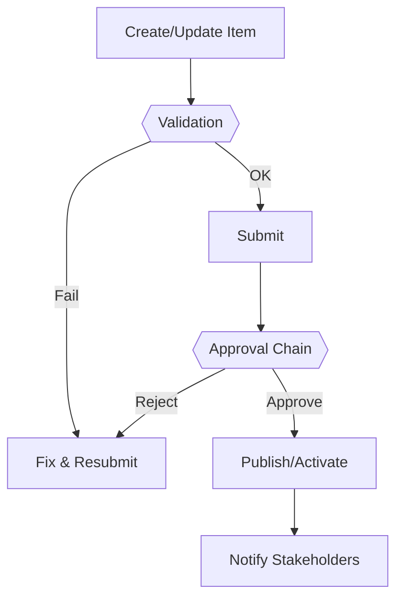

# Performance Management System — Panduan Administrator

> Dokumen ini untuk **administrator/HR admin/ops** yang mengelola modul **Performance Management System**: konfigurasi, peran/izin, integrasi, data, keamanan, pemeliharaan, dan troubleshooting.
> Terakhir diperbarui: 2025-09-17.

---

## 1) Ringkasan Modul & Tanggung Jawab Admin
- **Tujuan modul:** Siklus penilaian: KPI/OKR, review, feedback.
- **Pemilik proses:** HR/People Partner
- **Dependensi:** Template KPI, periode performance
- **Peran yang terlibat:** Admin, HR, Manager, Employee
- **Data sensitif:** Penilaian & feedback

!!! note "Checklist kesiapan produksi"
    - Konfigurasi dasar selesai
    - Role & permission diuji minimal 1 siklus
    - Alur approval berjalan (happy path & edge case)
    - Backup/retention ditetapkan
    - Monitoring dasar aktif

---

## 2) Konfigurasi Dasar
1. Buka **Settings → Performance**
2. Isi parameter utama:
   - - Siklus/periode
- Template KPI/kompetensi
- Bobot penilaian
3. Simpan & lakukan smoke test (lihat bagian *Pengujian & Validasi*).

**Variabel lingkungan (opsional):**
- - PERF_CYCLE (opsional)

---

## 3) Role, Permission, dan Kebijakan Akses
- **Peran utama:** Admin, HR, Manager, Employee
- **Akses minimum:** Employee isi self-review; manager review; HR kelola siklus
- **Kebijakan data:** Hasil penilaian private; audit akses

Contoh pemetaan (sesuaikan di Django Admin/Role Manager):

| Role | Create | Read | Update | Delete | Approve |
|------|--------|------|--------|--------|---------|
| Admin | ✔ | ✔ | ✔ | ✔ | ✔ |
| HR/Owner | ✔ | ✔ | ✔ | ⚠ (terbatas) | ✔ |
| Manager | ✖ | ✔ (bawahan) | ✖ | ✖ | ✔ |
| Employee | ✖ | ✔ (pribadi) | ✖ | ✖ | ✖ |

---

## 4) Struktur Data & Validasi
**Entitas utama & field penting:**
- - Cycle (start/end)
- Goal/KPI
- Review (self/manager)

**Validasi:** 
- Wajib: Periode, goal, skor
- Unik: ID review
- Aturan khusus: Review terkunci setelah submit final

**Retensi & arsip:** Dokumen performance disimpan {36} bulan

---

## 5) Alur Kerja & Approval

**Konfigurasi approval:**
- Rantai approve: Employee → Manager → HR (sign-off)
- SLA internal: Review selesai < 10 hari kerja
- Notifikasi: email/in-app (pastikan SMTP aktif)

---

## 6) Integrasi & Otomatisasi (opsional)
- - HRIS report, BI tools

**Webhook/Callback:** onCycleStarted, onReviewSubmitted
**Import/Export:** CSV/XLSX (periksa delimiter, encoding UTF-8)

---

## 7) Pengujian & Validasi
- **Smoke test:** buat → submit → approve → publish
- **Hak akses:** uji view/edit/delete per role
- **Data edge:** nilai kosong, tanggal bentrok, lampiran besar
- **Kinerja:** list >10k baris (gunakan filter & pagination)
- **Pembuktian:** screenshot/log hasil uji disimpan

---

## 8) Monitoring, Logging & Audit
- **Audit trail:** perubahan penting (create/update/delete/approve)
- **Log aplikasi:** error 4xx/5xx, timeout, validasi
- **Metrik:** throughput, error rate, waktu approve, backlog
- **Alert:** lonjakan 5xx, antrean approval > SLA

---

## 9) Backup, Restore & Retensi
- **Backup DB:** harian, format *custom* `.dump`
- **Backup lampiran:** sinkron rsync/object storage
- **Retensi:** Dokumen performance disimpan {36} bulan
- **Uji restore berkala:** buat environment *restore-test*

---

## 10) Keamanan & Kepatuhan
- **RBAC ketat** (least privilege)
- **PII/Payroll**: enkripsi in-transit (TLS), at-rest sesuai kebijakan
- **Sanitasi upload** (ekstensi/ukuran), antivirus (opsional)
- **Log admin** disimpan minimal 12 bulan

---

## 11) Troubleshooting Cepat
- **Tidak bisa create/update:** cek validation & permission
- **Approval tidak terkirim:** cek SMTP & rules notifier
- **Duplikasi data:** periksa constraint unik & import policy
- **Lambat saat listing:** aktifkan filter/pagination, kaji index DB
- **Lampiran gagal:** periksa batas ukuran & storage path

---

## 12) Roadmap & Catatan
- 9-box grid & calibration

---

## Lampiran
- **Endpoint terkait (jika API terbuka):** /api/performance/*
- **Lokasi menu:** Performance
- **Tugas admin harian:** - Pantau progres submit
- Follow-up manager yang terlambat
