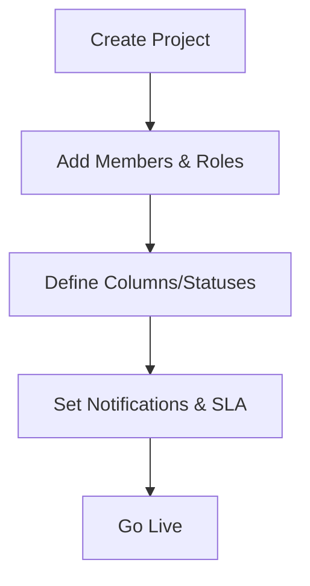

# :material-clipboard-flow: Project Management (Admin)

Konfigurasi proyek, board, status, SLA, notifikasi, serta kebijakan akses.

## Checklist Setup
- **Status**: To Do / In Progress / Review / Done (bisa kustom)
- **Board** per project (kolom = status)
- **Labels** (Bug, Feature, Urgent, …)
- **Default roles**: Owner, Member, Viewer
- **Notifikasi**: assignment, status changed, overdue

### Alur Pembuatan Project

## RBAC (Contoh)
| Role     | Create Project | Manage Members | Edit Tasks | Delete | View All |
|----------|:--------------:|:--------------:|:----------:|:------:|:--------:|
| Admin    | ✔︎             | ✔︎             | ✔︎         | ✔︎     | ✔︎       |
| Owner    | ✔︎             | ✔︎             | ✔︎         | ⚠︎     | ✔︎       |
| Member   | ✖︎             | ✖︎             | ✔︎(assigned)| ✖︎    | ✔︎(project)|
| Viewer   | ✖︎             | ✖︎             | ✖︎         | ✖︎     | ✔︎(read)  |

## Data & Validasi
**Project**: name*, owner*, members[], start_at, end_at, description  
**Task**: title*, project*, assignee, status*, priority, due_date, labels[], attachments[]

Aturan: status harus valid; `due_date >= today()` (opsional); perubahan kritikal tercatat di **audit log**.

## Integrasi
- **Webhook** `task.created/updated/done`
- **Notif Email** via SMTP
- **Export CSV** (tasks/time logs) untuk reporting

## Operasional
- **Backup**: project + tasks + attachments (opsional)
- **Monitoring**: tugas overdue/idle (report mingguan)
- **Troubleshoot**: email tidak terkirim → cek queue/SMTP; kartu tidak bisa dipindah → cek role
