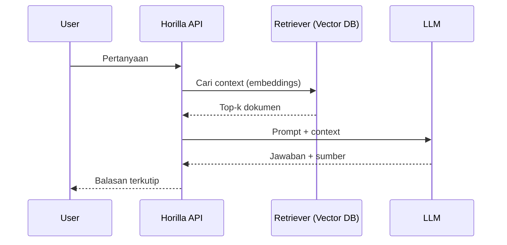

# AI Assistant untuk Horilla

Asisten percakapan untuk membantu user: tanya kebijakan HR, generate surat, ringkas tiket helpdesk, dan menjawab pertanyaan operasional.

_Terakhir diperbarui: 2025-09-18_

## Fitur
- QA berbasis dokumen internal (RAG)
- Ringkas/translate dokumen
- Template surat (SP, promosi, kontrak)
- Copilot workflow (contoh: rancang approval chain)

## Integrasi Teknis
- **Embeddings**: OpenAI `text-embedding-3-large`, atau lokal (e5/BGE)
- **Vector DB**: pgvector / Qdrant / Milvus
- **LLM**: OpenAI/Azure/OpenRouter, atau lokal (Ollama) via API kompatibel OpenAI
- **Auth**: token Horilla + filter RBAC pada retrieval
