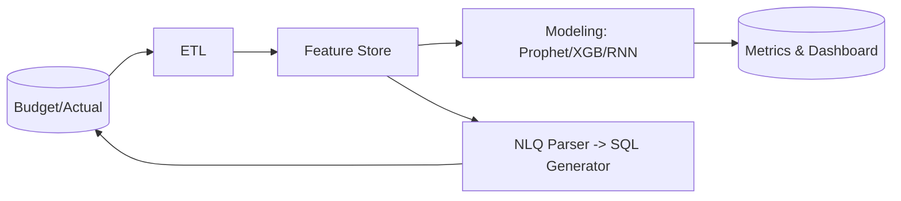

# AI Budget Analytics

Analitik anggaran berbasis AI: insight, outlier, dan forecast untuk modul Budget.

_Terakhir diperbarui: 2025-09-18_

## Fitur
- Outlier detection (IQR/MAD)
- Forecast (Prophet/XGBoost)
- NLQ (Natural-Language Query) → generator SQL terkontrol

## API
- `GET /api/analytics/budget/outliers?period=2025Q2`
- `GET /api/analytics/budget/forecast?gl=5201&horizon=6`
- `POST /api/analytics/budget/nlq` → `{ "query_text": "..."}`
