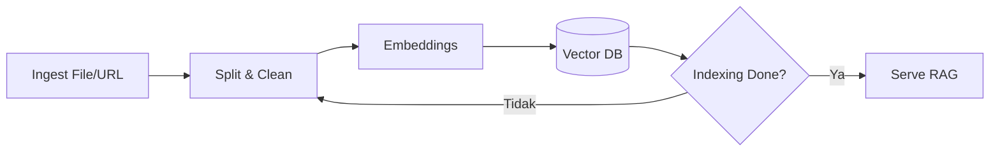

# AI untuk Knowledge Management Horilla

Pipeline untuk mengubah kebijakan HR, SOP, panduan user/admin menjadi basis pengetahuan yang dapat dicari & dijawab AI.

_Terakhir diperbarui: 2025-09-18_

## Sumber Knowledge
- Folder **Docs** Horilla (MD/HTML)
- Lampiran Helpdesk (PDF/Doc)
- Kebijakan HR (PDF)

## API
- `POST /api/knowledge/ingest`
- `GET /api/knowledge/search?q=...`
- `POST /api/knowledge/reindex`
