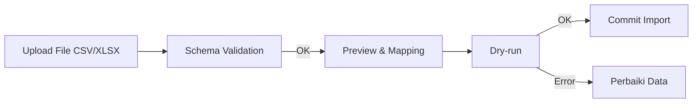

# Data Importer

_Terakhir diperbarui: 2025-09-18_

Wizard impor untuk data master (employee, org structure, assets) dan transaksi (attendance, leave, payroll adjustments).

## Flow

## Fitur
- Mapping kolom fleksibel
- Validasi per-baris (type, enum, foreign key)
- Dry-run dulu, baru commit

## Template
- `employee_template.xlsx`
- `org_template.xlsx`
- `attendance_template.xlsx`

## Log & Audit
- Simpan file, ringkasan baris sukses/gagal
- Unduh report error (CSV)
