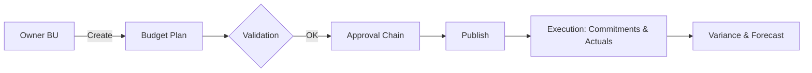

# Modul Budget

Modul untuk perencanaan & realisasi anggaran lintas departemen, terintegrasi dengan HR (org structure, approvals) dan Payroll (actuals).

_Terakhir diperbarui: 2025-09-18_

## Tujuan
- Menetapkan pagu per unit/GL/proyek
- Mencatat realisasi (commitment & actual)
- Monitoring deviasi & forecast

## Integrasi Horilla
- **Org/Employee**: hirarki approval mengikuti struktur org Horilla
- **Payroll**: tarik actual payroll sebagai realisasi (opsional)
- **Project**: atribut budget per proyek



## RBAC
| Role | Create | Read | Update | Delete | Approve | Post Actual |
|---|:--:|:--:|:--:|:--:|:--:|:--:|
| Admin | ✔ | ✔ | ✔ | ✔ | ✔ | ✔ |
| Finance | ✔ | ✔ | ✔ | ⚠ | ✔ | ✔ |
| Manager | ✔ | ✔(unit) | ✔ | ✖ | ✖ | ⚠ |
| Employee | ✖ | ✔(yang terkait) | ✖ | ✖ | ✖ | ✖ |

## Skema Data (ringkas)
- `budget_header(id, code, name, org_id, period_start, period_end, currency, status)`
- `budget_line(id, header_id, gl_code, project_id, qty, unit_price, amount)`
- `budget_actual(id, header_id, line_id, source, amount, doc_ref, posted_at)`
- `budget_forecast(id, header_id, line_id, amount, method, note)`

## API (contoh)
- `POST /api/budgets/`
- `GET /api/budgets/{id}`
- `POST /api/budgets/{id}/submit`
- `POST /api/budgets/{id}/approve`
- `POST /api/budgets/{id}/publish`
- `POST /api/budgets/{id}/actuals`
- `GET /api/budgets/{id}/variance`

### Contoh request
```bash
curl -H "Authorization: Token <API_KEY>" \
  -H "Content-Type: application/json" \
  -d '{
    "code":"BUD-2025-001","name":"Marketing 2025",
    "org_id": 12, "period_start":"2025-01-01","period_end":"2025-12-31",
    "currency":"IDR",
    "lines":[{"gl_code":"5201","project_id":null,"qty":12,"unit_price":5000000}]
  }' \
  https://yourdomain.com/api/budgets/
```

## Konfigurasi
```
BUDGET_APPROVAL_CHAIN=BU,FINANCE,CFO
BUDGET_CURRENCY_DEFAULT=IDR
BUDGET_ALLOW_OVERSPEND=false
```

## Event/Hook
- `budget.submitted`, `budget.approved`, `budget.published`, `budget.actual.posted`
