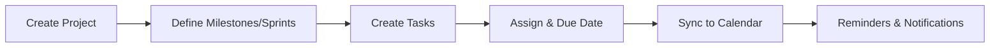

# Integrasi Project & Calendar

_Terakhir diperbarui: 2025-09-18_

Project (kini **stable**, bukan beta) terhubung dengan Calendar untuk penjadwalan task, sprint, dan event proyek.

## Alur

## API
- `POST /api/projects/` — buat proyek
- `POST /api/projects/<built-in function id>/tasks` — tambah task
- `POST /api/calendar/events` — buat event
- `GET /api/calendar/events?project_id=` — sinkronisasi

## Notifikasi
- Reminder via email/Slack
- Re-schedule otomatis saat konflik (opsional)

## Permissions
- Owner/Manager: CRUD project & sprint
- Member: update task sendiri
- Viewer: read only
