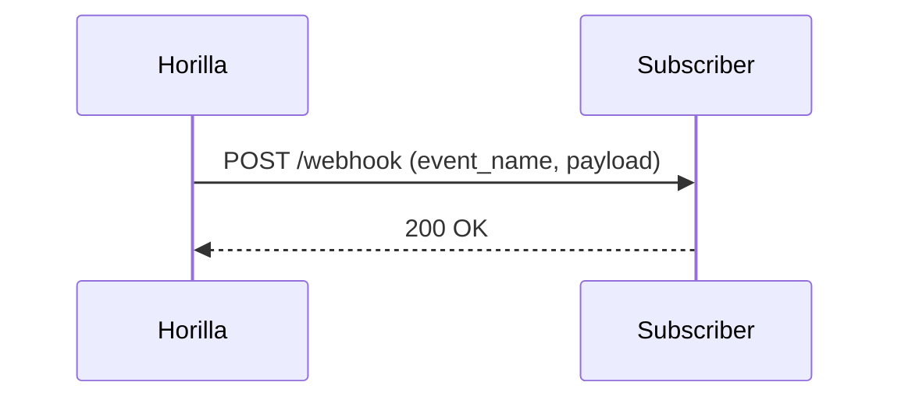

# Webhooks & Integrations

Terakhir diperbarui: 2025-09-18_

Modul untuk integrasi keluar-masuk via **webhook** (event-driven), serta sinkronisasi ke sistem eksternal (ERP, Slack, email, dll).

## Event yang Didukung
- employee.created/updated/terminated
- leave.submitted/approved/rejected
- payroll.payslip.generated
- helpdesk.ticket.created/updated
- budget.submitted/approved/published



## Konfigurasi
```
WEBHOOK_MAX_RETRY=5
WEBHOOK_BACKOFF_SECONDS=30
WEBHOOK_HMAC_SECRET=ubah_ini
```

## Keamanan
- HMAC signature header `X-Horilla-Signature`
- Retry dengan exponential backoff
- Dead-letter queue (opsional)

## API
- `POST /api/integrations/webhooks` (daftar endpoint)
- `DELETE /api/integrations/webhooks/<built-in function id>`
- `GET /api/integrations/deliveries?status=failed`

## Troubleshooting
- Pastikan response ≤ 3s
- Validasi signature
