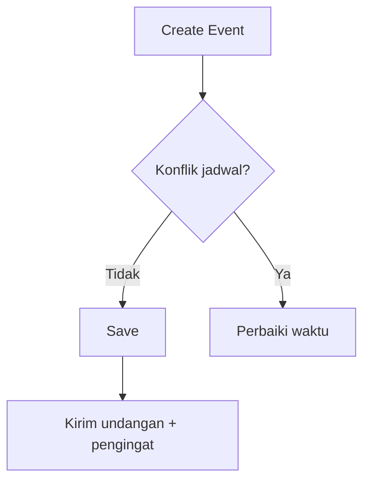

# :material-calendar: Calendar

Kalender perusahaan untuk melihat, membuat, dan membagikan acara (meeting, cuti, event internal).

## Ringkas
- Lihat **kalender pribadi** & **tim/perusahaan**
- Buat acara one-off atau **berulang**
- **Undang peserta**, set lokasi (offline/online), dan pengingat
- Sinkronisasi **iCal/ICS** (opsional)

## Mulai Cepat
1. Buka **Calendar → My/Team Calendar**
2. Klik **New Event**
3. Isi: *Title*, *Date/Time*, *Location/Link*, *Attendees*, *Reminder*
4. **Save** – undangan & notifikasi terkirim

### Alur Dasar

## Fitur Utama
- **Multiple calendars**: My, Team, Company
- **Recurring**: daily/weekly/monthly, dengan tanggal akhir
- **Reminders**: email/in-app (mis. 30m, 10m)
- **Join Link**: Zoom/Meet/Teams
- **Attachment**: lampirkan file agenda

## Tips
- Gunakan **category** (Meeting/Training/Company Event) agar mudah difilter
- Untuk libur nasional, lihat kalender **Company Holidays** (admin mengatur)

## FAQ
**Tidak menerima notifikasi?** Cek spam & pengaturan reminder; hubungi admin bila tetap tidak ada.
