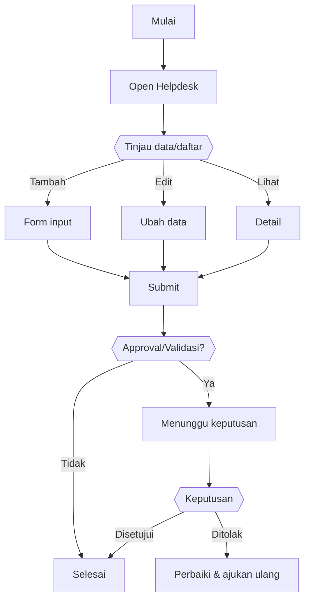

# Helpdesk — Panduan Pengguna

> Dokumen ini menjelaskan cara menggunakan modul **Helpdesk** untuk pengguna aplikasi Horilla.
> Terakhir diperbarui: 2025-09-17.

---

## 1) Ringkasan Modul
- **Tujuan:** Pelaporan masalah/permintaan (HR/IT/Payroll) dan pelacakan status.
- **Siapa yang menggunakan:** Semua pengguna.
- **Tergantung pada:** Kategori ticket, SLA internal, template balasan (opsional).
- **Izin minimal:** User (create/view own), Agent/Admin (triage/resolve).

!!! tip "Butuh bantuan?"
    Jika ada menu yang tidak terlihat, kemungkinan Anda tidak memiliki izin/role yang sesuai. Hubungi admin.

---

## 2) Akses & Navigasi
1. Masuk ke aplikasi Horilla.
2. Buka menu **Helpdesk** dari sidebar.
3. Gunakan **pencarian, filter,** dan **aksi** yang tersedia di bagian atas daftar.

---

## 3) Alur Kerja Umum

---

## 4) Tugas yang Sering Dilakukan

### 4.1 Membuat entri baru
1. Klik **New / Create**.
2. Isi field yang wajib bertanda *\**.
3. Klik **Save/Submit**.

### 4.2 Mengedit entri
1. Buka item pada daftar → **Edit**.
2. Ubah field yang diizinkan → **Save**.

### 4.3 Mencari & memfilter
- Gunakan kolom pencarian dan filter (tanggal/status/kategori).
- Klik **Reset** untuk menghapus filter.

### 4.4 Ekspor data (jika tersedia)
- Klik **Export** untuk mengunduh CSV/XLSX/PDF.

---

## 5) Notifikasi & Persetujuan
- Notifikasi dikirim saat item dibuat/diubah/diajukan untuk approval.
- Status **Pending/Approved/Rejected** tampil pada kolom **Status**.
- Manajer melakukan **Approve/Reject** dari menu **Approvals** atau dari detail item (jika tersedia).

---

## 6) Tips & Best Practice
- Gunakan **lampiran/evidence** bila diminta (format JPG/PNG/PDF).
- Pastikan data yang diisi akurat untuk mempercepat approval.
- Periksa **riwayat/aktivitas** untuk melihat perubahan pada item.

---

## 7) FAQ
**Q:** Saya tidak melihat tombol *New/Create*  
**A:** Izin Anda kemungkinan hanya *read-only*. Hubungi admin untuk akses yang sesuai.

**Q:** Status saya tidak berubah sejak kemarin  
**A:** Cek notifikasi/komentar di item; jika perlu, hubungi approver atau buat tiket Helpdesk.

**Q:** File lampiran gagal diunggah  
**A:** Periksa ukuran/format file, coba ulang, atau kompres dokumen.

---

## 8) Referensi Cepat
- Sidebar → **Helpdesk**
- Notifikasi → ikon lonceng di header
- Bantuan → **Helpdesk**

---

## 9) Catatan Khusus Modul
- Gunakan **kategori** yang tepat agar cepat ditangani.
- Sertakan bukti/screenshot untuk mempercepat penyelesaian.

